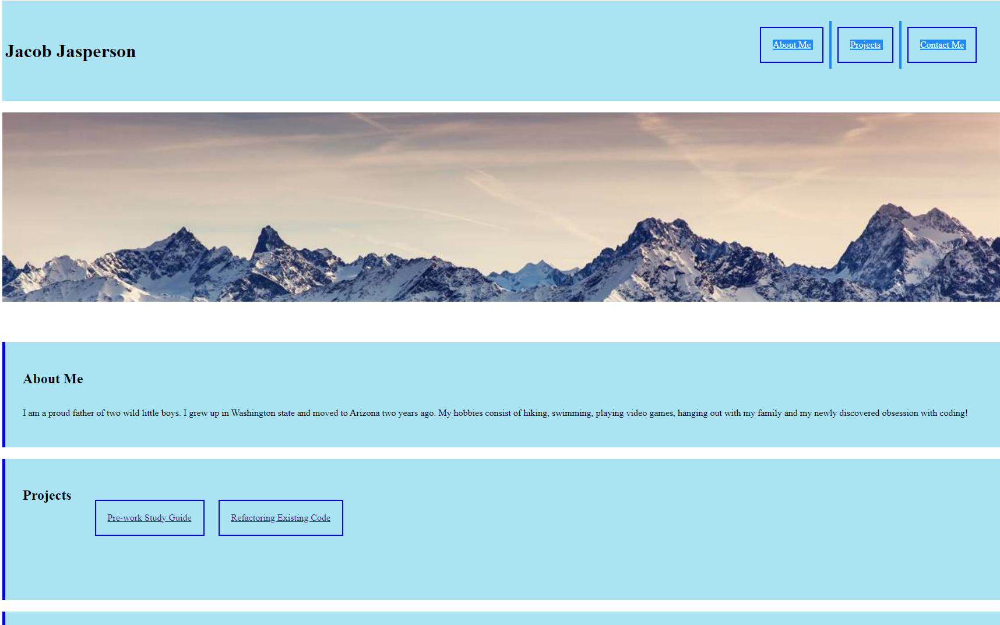

# <Portfolio>

## Description

My goal of this webpage is to easily direct the user to find out more about me and the work I've done so far. I also hoped to establish a framework for future updating and use in a professional environment. In this project I learned how to better use HTML and CSS as well as compartmentalizing sections of the work so that the larger task at hand isn't as daunting.

    

    

## License

MIT License
